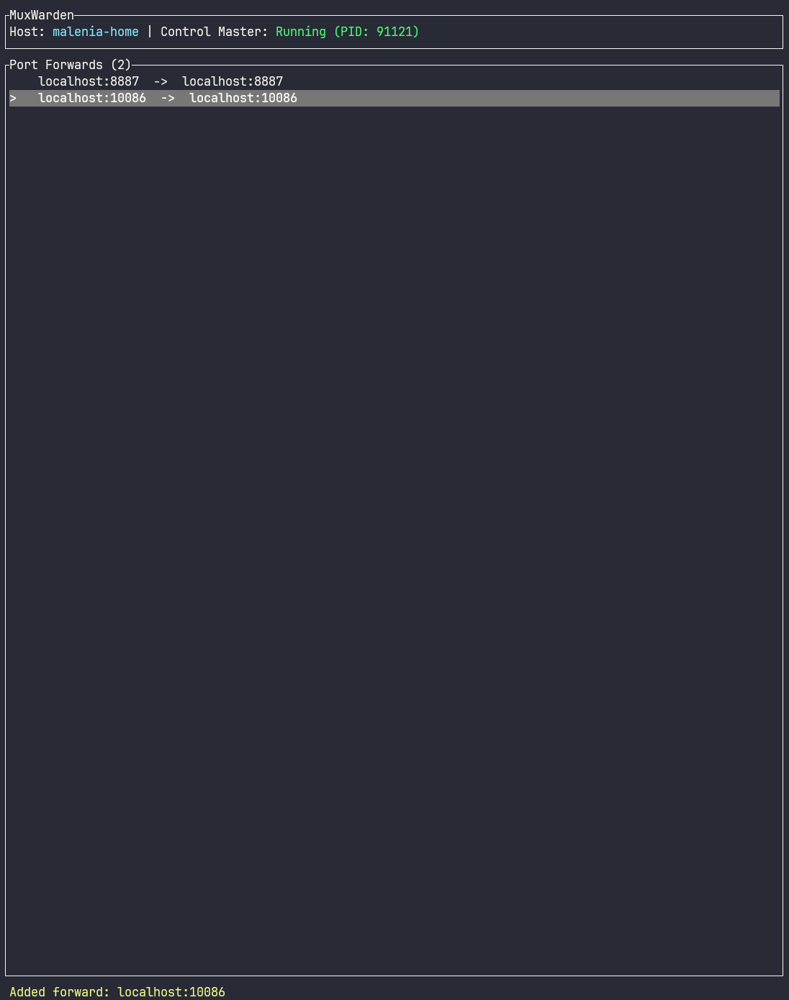

# MuxWarden

A terminal UI for managing SSH multiplex connections and port forwarding.

## Motivation

When doing remote development from a laptop to a server, SSH multiplexing (`ControlMaster`) is essential for fast connection reuse. However, managing the port forwards on these persistent connections is cumbersome—you need to remember arcane `ssh -O forward` commands and track which ports are already forwarded.

MuxWarden solves this by providing a simple TUI to:
- View all active port forwards on an SSH control master
- Add new port forwards with a keystroke
- Remove existing forwards just as easily
- Auto-start the control master if it's not running

## Usage

```bash
# Launch the TUI for a host
muxwarden myserver

# One-shot commands (no TUI)
muxwarden myserver forward 8080
muxwarden myserver cancel 8080
```

### TUI Controls

| Key | Action |
|-----|--------|
| `j` / `↓` | Move selection down |
| `k` / `↑` | Move selection up |
| `a` | Add a new port forward |
| `d` | Delete selected forward |
| `q` / `Esc` | Quit |

### Screenshots



## Prerequisites

Your SSH config must have `ControlMaster` and `ControlPath` configured for the target host:

```ssh-config
# ~/.ssh/config
Host myserver
    HostName myserver.example.com
    ControlMaster auto
    ControlPath ~/.ssh/cm-%r@%h:%p
    ControlPersist 10m
```

## Installation

### Using Nix Flakes

Add to your flake inputs:

```nix
{
  inputs.muxwarden.url = "github:breakds/muxwarden";
}
```

Then either:

**Option 1:** Add the overlay and use `pkgs.muxwarden`:

```nix
{
  nixpkgs.overlays = [ inputs.muxwarden.overlays.default ];
  environment.systemPackages = [ pkgs.muxwarden ];
}
```

**Option 2:** Use the package directly:

```nix
{
  environment.systemPackages = [ inputs.muxwarden.packages.${system}.default ];
}
```

### Try without installing

```bash
nix run github:breakds/muxwarden -- myserver
```

## License

MIT
